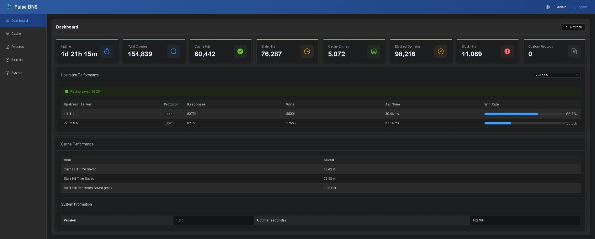

# Pulse DNS

[中文文档](README_CN.md)

A high-performance DNS server with ad-blocking, smart caching, and web-based management interface.



## Features

### Multi-Protocol Support

- **UDP/TCP DNS** - Standard DNS protocols for maximum compatibility
- **DNS-over-HTTPS (DoH)** - Encrypted DNS with HTTP/1.1, HTTP/2, and HTTP/3 (QUIC) support
- **DNS-over-TLS (DoT)** - Privacy-focused encrypted DNS
- **IPv4 & IPv6 Dual-Stack** - Full support for both IPv4 and IPv6 client connections and upstream servers

### Smart Caching

- **Stale-While-Revalidate** - Return cached responses instantly while refreshing in background
- **Flexible TTL Modes** - Fixed, multiplier, or respect original DNS TTL
- **Cache Persistence** - Survive restarts without losing cached data
- **Configurable Limits** - Set maximum cache entries (default: 100,000)

### Ad Blocking

- **Local Hosts Files** - Load multiple local blocklists
- **Remote Updates** - Auto-fetch and update blocklists from URLs
- **CNAME Chain Tracking** - Block ads hidden behind CNAME redirects (configurable depth)
- **Block Statistics** - Track blocked query counts

### Upstream Management

- **First-Wins Racing** - Query all upstreams concurrently, use the fastest response
- **Multi-Protocol Upstreams** - Mix UDP, DoH, and DoT upstream servers
- **Performance Monitoring** - Track response times and win rates per upstream

### Custom DNS Records

- **9 Record Types** - A, AAAA, CNAME, TXT, MX, SRV, NS, PTR, CAA
- **Dynamic Management** - Add/remove records via REST API without restart
- **Highest Priority** - Custom records take precedence over upstream

### Web Management Interface

- **Real-time Dashboard** - Monitor queries, cache hits, blocked requests
- **Cache Management** - Browse, search, and clear cached entries
- **Blocklist Viewer** - View all blocked domains
- **Record Management** - Manage custom DNS records
- **Internationalization** - English and Chinese UI

## Performance

- **No GC, No STW** - Zero garbage collection pauses for consistent low-latency responses
- High concurrency across all protocols (UDP, TCP, DoH with HTTP/1.1/2/3, DoT)
- High-performance caching with lock-free reads
- Query deduplication (singleflight) to reduce upstream load
- HTTP/3 (QUIC) acceleration for DoH queries

## Installation

### Download

Download the latest release for your platform from the Releases page:

**macOS**

| Architecture | DMG | App | Archive |
|--------------|-----|-----|---------|
| Apple Silicon (ARM64) | `pulse_dns-vX.X.X-aarch64-apple-darwin.dmg` | `.app.zip` | `.tar.gz` |
| Intel (x64) | `pulse_dns-vX.X.X-x86_64-apple-darwin.dmg` | `.app.zip` | `.tar.gz` |

**Linux**

| Architecture | AppImage | glibc | musl |
|--------------|----------|-------|------|
| x64 | `pulse_dns-vX.X.X-x86_64.AppImage` | `-x86_64-unknown-linux-gnu.tar.gz` | `-x86_64-unknown-linux-musl.tar.gz` |
| ARM64 | `pulse_dns-vX.X.X-aarch64.AppImage` | `-aarch64-unknown-linux-gnu.tar.gz` | `-aarch64-unknown-linux-musl.tar.gz` |

**Windows**

| Architecture | File |
|--------------|------|
| x64 | `pulse_dns-vX.X.X-x86_64-pc-windows-msvc.zip` |
| ARM64 | `pulse_dns-vX.X.X-aarch64-pc-windows-msvc.zip` |

### Directory Structure

```
pulse_dns           # Main executable
config.toml         # Configuration file
static/             # Web interface assets
hosts               # Local blocklist (optional)
custom_records.json # Custom DNS records (auto-created)
```

### Running

```bash
# Run with default config (config.toml in current directory)
./pulse_dns

# Run with custom config file
./pulse_dns -c /path/to/config.toml
```

## Configuration

### Server Settings

```toml
# UDP DNS Server
[udp_server]
enable = true
port = 53

# TCP DNS Server
[tcp_server]
enable = false
port = 53

# DoH Server (HTTPS)
[http_server]
enable = true
port = 443
cert = "cert.pem"
key = "key.pem"

# DoH Server (HTTP, for reverse proxy)
[http_plain_server]
enable = false
port = 8053

# DoT Server
[tls_server]
enable = true
port = 853
cert = "cert.pem"
key = "key.pem"
```

### Upstream Servers

```toml
# UDP Upstream
[[upstream_server]]
enable = true
name = "1.1.1.1"
protocol = "udp"
port = 53

# DoT Upstream
[[upstream_server]]
enable = true
name = "1.1.1.1"
protocol = "dot"
port = 853
sni = "cloudflare-dns.com"

# DoH Upstream
[[upstream_server]]
enable = true
name = "cloudflare-doh"
protocol = "doh"
url = "https://1.1.1.1/dns-query"
http_version = 2  # 1, 2, or 3

# Upstream filtering options
[upstream]
skip_blocked_response = false  # Skip 0.0.0.0/127.0.0.1 responses
skip_empty_response = false    # Skip empty responses
```

### Cache Settings

```toml
[cache]
# Stale-while-revalidate mode
stale_while_revalidate = true

# TTL mode: fixed | multiplier | dns_ttl
ttl_mode = "fixed"
ttl_seconds = 86400        # For fixed mode
ttl_multiplier = 2.0       # For multiplier mode
min_ttl_seconds = 60       # Minimum TTL
max_ttl_seconds = 86400    # Maximum TTL

# Persistence
persist_on_shutdown = true
max_entries = 100000
```

### Ad Blocking

```toml
[ad_block]
enable = true

# Local hosts files
hosts_files = ["hosts", "hosts.local"]

# Remote blocklist URLs
update_urls = [
    "https://raw.githubusercontent.com/StevenBlack/hosts/master/hosts"
]
update_interval_seconds = 86400  # 24 hours

# CNAME tracking
cname_blocking = true
cname_max_depth = 8
block_ttl_seconds = 60

# Statistics
count_blocked_hits = true
```

### Admin Interface

```toml
[admin]
enable = true
bind = ":8080"
username = "admin"
password = "your_password"
jwt_secret = "your_secret_key"
jwt_expiry_seconds = 86400
static_dir = "static"
records_file = "custom_records.json"

# Trusted proxies (for X-Forwarded-For)
trusted_proxies = ["127.0.0.1", "192.168.0.0/16"]
# Or trust all: trusted_proxies = ["*"]
```

### Statistics

```toml
[stats]
count_total_queries = true
count_cache_hits = true
count_stale_hits = true
```

## Usage

After starting the server, you can:

1. **Configure your devices** to use the DNS server IP address
2. **Access the web interface** at `http://server-ip:8080`
3. **Test DNS resolution**:
   ```bash
   # Test standard query
   dig @server-ip example.com

   # Test ad blocking (should return 0.0.0.0)
   dig @server-ip ad.doubleclick.net
   ```
