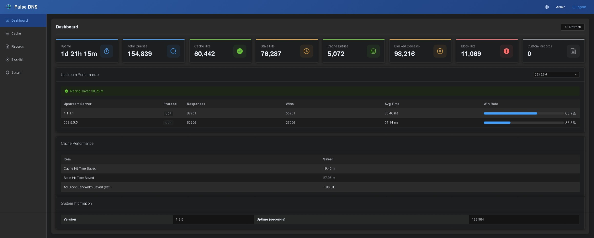

# Pulse DNS

[中文文档](README_CN.md)

A modern, high-performance DNS server featuring multi-protocol encryption, intelligent caching, multi-source ad blocking, live query streaming, and an intuitive web management console.



## Features

### Multi-Protocol & Modern Encryption

- **UDP & TCP DNS** - Standard RFC-compliant DNS for universal device compatibility
- **DNS-over-HTTPS (DoH)** - Encrypted DNS supporting HTTP/1.1, HTTP/2, and HTTP/3 (QUIC)
- **DNS-over-TLS (DoT)** - Privacy-preserving encrypted DNS over TLS
- **DNS-over-QUIC (DoQ)** - RFC 9250 encrypted DNS with ultra-low connection latency
- **IPv4 & IPv6 Dual-Stack** - Full dual-stack support across client listeners and upstream resolvers

### Intelligent Caching & Retention

- **Stale-While-Revalidate** - Zero-latency cached responses with background asynchronous revalidation
- **Granular TTL Preservation** - Preserves individual record TTL values accurately
- **Flexible TTL Modes** - Respect original DNS TTL, fixed TTL, or multiplier modes
- **Persistent Cache** - High-capacity in-memory cache preserved across server restarts
- **Lock-Free Reads & Deduplication** - High-throughput lock-free cache lookups and query deduplication

### Multi-Source Protection & Ad Blocking

- **Multi-Source Rule Subscriptions** - Combine local hosts files with remote subscription lists
- **Instant & Scheduled Updates** - One-click instant rule downloads via Web UI and automated background syncing
- **Deep Alias Tracking** - Uncover and block hidden ads and trackers across CNAME, HTTPS, and SVCB alias chains
- **Protection Analytics** - Track blocked query volume and estimated bandwidth savings

### Intelligent Upstream Racing & Latency Optimization

- **Fastest-Wins Concurrent Racing** - Race queries across multiple upstreams and protocols for minimal latency
- **Upstream Telemetry** - Monitor response latency, win rate percentages, and cumulative time savings
- **Smart Response Filtering** - Automatically skip blocked or malformed upstream responses

### Response Policy & Gateway Control

- **SVCB / HTTPS Policy Control** - Granular control over SVCB/HTTPS records (such as ECH parameter management) for enterprise gateway visibility and firewall compatibility while preserving modern ALPN, HTTP/3, and port hints

### Live Query Stream & Telemetry Dashboard

- **Real-Time Query Monitor** - Live streaming monitor showing client IPs, query types, protocols, response codes, and durations
- **Comprehensive Analytics** - Real-time dashboards for query rates, cache hit efficiency, time savings, and upstream performance

### Dynamic DNS Records

- **9 Standard Record Types** - Full support for A, AAAA, CNAME, TXT, MX, SRV, NS, PTR, and CAA
- **Hot Updates** - Add, modify, or delete custom records dynamically via Web UI or REST API without restarting
- **Highest Priority** - Custom records take precedence over upstream resolution

### Web Console & Built-in Security

- **Modern Web Interface** - Clean, responsive UI with Dark, Light, and System themes in English and Chinese
- **Adaptive Rate Limiting** - Built-in brute-force protection with login rate limits and automatic IP lockouts
- **Secure Authentication** - Bcrypt password hashing, secure JWT tokens, and trusted proxy CIDR support

## Performance

- **Zero GC Pauses** - Predictable, ultra-low latency response under heavy workloads
- **High Concurrency** - Optimized for high query throughput across all protocols (UDP, TCP, DoH, DoT, DoQ)
- **Lock-Free Architecture** - High-concurrency lock-free cache access and query deduplication
- **HTTP/3 & QUIC Acceleration** - Modern QUIC transport for accelerated encrypted lookups

## Installation

### Download

Download the latest release for your platform from the Releases page:

**macOS**

| Architecture | DMG | App | Archive |
|--------------|-----|-----|---------|
| Apple Silicon (ARM64) | `pulse_dns-vX.X.X-aarch64-apple-darwin.dmg` | `.app.zip` | `.tar.gz` |
| Intel (x64) | `pulse_dns-vX.X.X-x86_64-apple-darwin.dmg` | `.app.zip` | `.tar.gz` |

**Linux**

| Architecture | AppImage | glibc | musl |
|--------------|----------|-------|------|
| x64 | `pulse_dns-vX.X.X-x86_64.AppImage` | `-x86_64-unknown-linux-gnu.tar.gz` | `-x86_64-unknown-linux-musl.tar.gz` |
| ARM64 | `pulse_dns-vX.X.X-aarch64.AppImage` | `-aarch64-unknown-linux-gnu.tar.gz` | `-aarch64-unknown-linux-musl.tar.gz` |

**Windows**

| Architecture | File |
|--------------|------|
| x64 | `pulse_dns-vX.X.X-x86_64-pc-windows-msvc.zip` |
| ARM64 | `pulse_dns-vX.X.X-aarch64-pc-windows-msvc.zip` |

### Directory Structure

```
pulse_dns           # Main executable
config.toml         # Configuration file
static/             # Web interface assets
hosts               # Local blocklist (optional)
custom_records.json # Custom DNS records (auto-created)
```

### Running

```bash
# Run with default config (config.toml in current directory)
./pulse_dns

# Run with custom config file
./pulse_dns -c /path/to/config.toml
```

## Configuration

### Server Settings

```toml
# UDP DNS Server
[udp_server]
enable = true
port = 53

# TCP DNS Server
[tcp_server]
enable = false
port = 53

# DoH Server (HTTPS with HTTP/1.1, HTTP/2, HTTP/3)
[http_server]
enable = true
port = 443
cert = "cert.pem"
key = "key.pem"

# DoH Server (HTTP, for reverse proxies)
[http_plain_server]
enable = false
port = 8053

# DoT Server (TLS)
[tls_server]
enable = true
port = 853
cert = "cert.pem"
key = "key.pem"

# DoQ Server (QUIC over UDP)
[doq_server]
enable = true
port = 853
cert = "cert.pem"
key = "key.pem"

# DNS Response Policy
[dns_policy]
# Control ECH parameter in SVCB/HTTPS records for gateway visibility
strip_ech = true
```

### Upstream Servers

```toml
# UDP Upstream
[[upstream_server]]
enable = true
name = "1.1.1.1"
protocol = "udp"
port = 53

# DoT Upstream
[[upstream_server]]
enable = true
name = "1.1.1.1"
protocol = "dot"
port = 853
sni = "cloudflare-dns.com"

# DoH Upstream
[[upstream_server]]
enable = true
name = "cloudflare-doh"
protocol = "doh"
url = "https://1.1.1.1/dns-query"
http_version = 2  # 1, 2, or 3

# Upstream filtering options
[upstream]
skip_blocked_response = false  # Skip 0.0.0.0/127.0.0.1 responses
skip_empty_response = false    # Skip empty responses
```

### Cache Settings

```toml
[cache]
# Stale-while-revalidate mode
stale_while_revalidate = true

# TTL mode: fixed | multiplier | dns_ttl
ttl_mode = "fixed"
ttl_seconds = 86400        # For fixed mode
ttl_multiplier = 2.0       # For multiplier mode
min_ttl_seconds = 60       # Minimum TTL
max_ttl_seconds = 86400    # Maximum TTL

# Persistence & limits
persist_on_shutdown = true
max_entries = 100000
```

### Ad Blocking & Rules

```toml
[ad_block]
enable = true

# Local hosts files
hosts_files = ["hosts", "hosts.local"]

# Remote blocklist subscription URLs
update_urls = [
    "https://raw.githubusercontent.com/StevenBlack/hosts/master/hosts"
]
update_interval_seconds = 86400  # Automatic refresh interval

# Deep alias tracking
cname_blocking = true
cname_max_depth = 8
cname_probe_upstream = false
block_ttl_seconds = 60

# Statistics
count_blocked_hits = true
```

### Web Management & Security

```toml
[admin]
enable = true
bind = ":8080"
username = "admin"
password = "your_password"
jwt_secret = "your_secret_key"
jwt_expiry_seconds = 86400
static_dir = "static"
records_file = "custom_records.json"

# Trusted proxy CIDRs (for client IP detection)
trusted_proxies = ["127.0.0.1", "192.168.0.0/16"]
```

### Statistics

```toml
[stats]
count_total_queries = true
count_cache_hits = true
count_stale_hits = true
```

## Usage

After starting the server:

1. **Configure your devices / routers** to use PulseDNS as the primary DNS resolver.
2. **Access the Web Management Interface** at `http://server-ip:8080`.
3. **Verify resolution & ad blocking**:
   ```bash
   # Test standard resolution
   dig @server-ip example.com

   # Test ad blocking (returns 0.0.0.0)
   dig @server-ip ad.doubleclick.net
   ```
