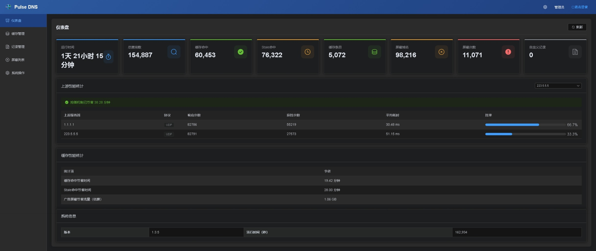

# Pulse DNS

[English](README.md)

新一代高性能 DNS 服务器，集成了全协议加密、智能极速缓存、多源规则广告拦截、实时查询监控流与现代化 Web 控制台。



## 功能特性

### 全协议与现代加密支持

- **UDP / TCP DNS** - 标准 DNS 协议，最大化设备兼容性
- **DNS-over-HTTPS (DoH)** - 加密 DNS，全面支持 HTTP/1.1、HTTP/2 及 HTTP/3 (QUIC)
- **DNS-over-TLS (DoT)** - 隐私保护的 TLS 加密 DNS
- **DNS-over-QUIC (DoQ)** - 符合 RFC 9250 规范的 QUIC 加密 DNS，超低连接延迟
- **IPv4 & IPv6 双栈** - 客户端监听与上游解析全面支持 IPv4 / IPv6 双栈环境

### 智能极速缓存与留存

- **Stale-While-Revalidate** - 毫秒级返回缓存响应，后台异步刷新（零延迟感知）
- **精准保留逐条记录 TTL** - 缓存记录精准保留原始各记录的独立 TTL
- **灵活的 TTL 策略** - 支持遵循 DNS 原始 TTL、固定值或倍数模式
- **缓存跨重启持久化** - 重启进程保留缓存数据，杜绝冷启动性能抖动
- **无锁极速读取与请求去重** - 高并发无锁缓存检索与请求合并去重

### 多源规则与深度广告防护

- **多源规则订阅** - 灵活组合本地 hosts 文件与多个远程订阅 URL
- **即时与定时更新** - Web 控制台一键立即下载更新规则库，支持后台定时自动同步
- **CNAME / HTTPS 别名追踪** - 深度追踪隐藏在 CNAME、HTTPS、SVCB 别名背后的广告与威胁
- **防护与流量统计** - 实时统计拦截查询数与流量节省估算

### 智能上游优选与耗时分析

- **First-Wins 并发竞速** - 多上游、跨协议并发优选，自动采用最快响应
- **上游性能监控** - 实时追踪各上游服务器响应延迟、胜率及抢答累计节省耗时
- **智能响应过滤** - 自动识别并跳过受阻响应与空响应

### 响应策略与网关适配

- **SVCB / HTTPS 策略控制** - 支持调控 SVCB/HTTPS 记录中的 ECH（Encrypted Client Hello）参数，保障企业网关过滤与网络识别兼容，同时完整保留 ALPN、HTTP/3、端口及别名提示

### 实时查询流与监控看板

- **实时查询流监控** - 动态流式监控实时 DNS 请求，即时查看客户端 IP、协议、查询类型、处理耗时与响应码
- **多维可视化看板** - 直观掌握总查询量、缓存命中率、节省时间与系统运行指标

### 动态自定义 DNS 记录

- **9 种标准记录类型** - 完整支持 A、AAAA、CNAME、TXT、MX、SRV、NS、PTR、CAA
- **动态热更新** - 通过 Web 界面或 REST API 实时添加/修改/删除记录，无需重启服务
- **最高解析优先级** - 自定义记录优先于上游查询结果

### 现代化控制台与内置安全防护

- **现代化 Web 控制台** - 响应式设计，支持浅色、深色及跟随系统主题，中英文界面无缝切换
- **自适应防爆破限流** - 内置登录速率限制与恶意 IP 自动封禁锁定
- **安全认证与代理支持** - 采用 bcrypt 密码加密，支持可信代理 CIDR 提取真实客户端 IP

## 性能表现

- **无 GC、无 STW** - 零垃圾回收停顿，在高并发场景下保持稳健的超低延迟响应
- **全协议高并发** - 针对 UDP、TCP、DoH (HTTP/1.1/2/3)、DoT、DoQ 进行全链路高并发优化
- **无锁架构与请求去重** - 高效无锁缓存读写与 singleflight 请求去重
- **HTTP/3 & QUIC 传输加速** - 借助新一代 QUIC 传输层降低握手与传输开销

## 安装指南

### 下载

从 Releases 页面下载对应操作系统的预编译包：

**macOS**

| 架构 | DMG 安装包 | App 压缩包 | 归档文件 |
|------|-----------|-----------|---------|
| Apple Silicon (ARM64) | `pulse_dns-vX.X.X-aarch64-apple-darwin.dmg` | `.app.zip` | `.tar.gz` |
| Intel (x64) | `pulse_dns-vX.X.X-x86_64-apple-darwin.dmg` | `.app.zip` | `.tar.gz` |

**Linux**

| 架构 | AppImage | glibc 版本 | musl 静态版本 |
|------|----------|-----------|--------------|
| x64 | `pulse_dns-vX.X.X-x86_64.AppImage` | `-x86_64-unknown-linux-gnu.tar.gz` | `-x86_64-unknown-linux-musl.tar.gz` |
| ARM64 | `pulse_dns-vX.X.X-aarch64.AppImage` | `-aarch64-unknown-linux-gnu.tar.gz` | `-aarch64-unknown-linux-musl.tar.gz` |

**Windows**

| 架构 | 文件名 |
|------|--------|
| x64 | `pulse_dns-vX.X.X-x86_64-pc-windows-msvc.zip` |
| ARM64 | `pulse_dns-vX.X.X-aarch64-pc-windows-msvc.zip` |

### 目录结构

```
pulse_dns           # 主程序
config.toml         # 配置文件
static/             # Web 界面资源
hosts               # 本地屏蔽列表（可选）
custom_records.json # 自定义 DNS 记录（自动创建）
```

### 启动运行

```bash
# 使用默认配置（当前目录下的 config.toml）
./pulse_dns

# 指定配置文件路径
./pulse_dns -c /path/to/config.toml
```

## 配置说明

### 服务器配置

```toml
# UDP DNS 服务器
[udp_server]
enable = true
port = 53

# TCP DNS 服务器
[tcp_server]
enable = false
port = 53

# DoH 服务器（HTTPS，支持 HTTP/1.1、HTTP/2 与 HTTP/3）
[http_server]
enable = true
port = 443
cert = "cert.pem"
key = "key.pem"

# DoH 服务器（HTTP，用于反向代理）
[http_plain_server]
enable = false
port = 8053

# DoT 服务器（TLS）
[tls_server]
enable = true
port = 853
cert = "cert.pem"
key = "key.pem"

# DoQ 服务器（基于 UDP 的 QUIC）
[doq_server]
enable = true
port = 853
cert = "cert.pem"
key = "key.pem"

# DNS 响应策略
[dns_policy]
# 调控 SVCB/HTTPS 记录中的 ECH 参数，满足网关可见性需求
strip_ech = true
```

### 上游服务器

```toml
# UDP 上游
[[upstream_server]]
enable = true
name = "223.5.5.5"
protocol = "udp"
port = 53

# DoT 上游
[[upstream_server]]
enable = true
name = "1.1.1.1"
protocol = "dot"
port = 853
sni = "cloudflare-dns.com"

# DoH 上游
[[upstream_server]]
enable = true
name = "cloudflare-doh"
protocol = "doh"
url = "https://1.1.1.1/dns-query"
http_version = 2  # 1、2 或 3

# 上游过滤选项
[upstream]
skip_blocked_response = false  # 跳过 0.0.0.0/127.0.0.1 响应
skip_empty_response = false    # 跳过空响应
```

### 缓存配置

```toml
[cache]
# Stale-while-revalidate 模式
stale_while_revalidate = true

# TTL 模式：fixed（固定）| multiplier（倍数）| dns_ttl（遵循原始）
ttl_mode = "fixed"
ttl_seconds = 86400        # 固定模式使用
ttl_multiplier = 2.0       # 倍数模式使用
min_ttl_seconds = 60       # 最小 TTL
max_ttl_seconds = 86400    # 最大 TTL

# 持久化与容量上限
persist_on_shutdown = true
max_entries = 100000
```

### 规则与广告屏蔽

```toml
[ad_block]
enable = true

# 本地 hosts 文件
hosts_files = ["hosts", "hosts.local"]

# 远程规则订阅 URL
update_urls = [
    "https://raw.githubusercontent.com/StevenBlack/hosts/master/hosts"
]
update_interval_seconds = 86400  # 自动更新间隔（秒）

# 别名深度追踪
cname_blocking = true
cname_max_depth = 8
cname_probe_upstream = false
block_ttl_seconds = 60

# 统计
count_blocked_hits = true
```

### 管理界面与安全

```toml
[admin]
enable = true
bind = ":8080"
username = "admin"
password = "your_password"
jwt_secret = "your_secret_key"
jwt_expiry_seconds = 86400
static_dir = "static"
records_file = "custom_records.json"

# 信任的代理 IP / CIDR（用于识别客户端真实 IP）
trusted_proxies = ["127.0.0.1", "192.168.0.0/16"]
```

### 统计配置

```toml
[stats]
count_total_queries = true
count_cache_hits = true
count_stale_hits = true
```

## 使用方法

启动服务后：

1. **配置设备 / 路由器** DNS 服务器地址为本机 IP。
2. **访问 Web 管理界面** `http://服务器IP:8080`。
3. **测试 DNS 解析**：
   ```bash
   # 测试标准查询
   dig @服务器IP example.com

   # 测试广告拦截（返回 0.0.0.0）
   dig @服务器IP ad.doubleclick.net
   ```
